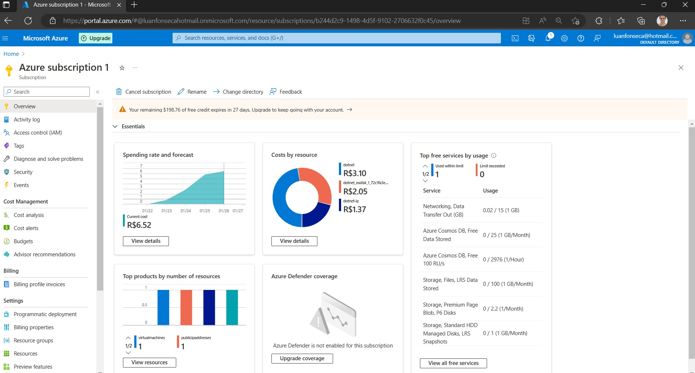

<h1> API - Projeto Radar - Código do Futuro

# :computer:  Equipe de DESENVOLVEDORES

<table align="center">
  <tr>
    <td align="center">
      <a href="https://github.com/GuiHSM">
         
        
          <b>Guilherme Marcelino</b>
        
      </a>
    </td>
    <td align="center">
      <a href="https://github.com/Luanftg">
         
        
          <b>Luan F. T. Gimenez</b>
        
      </a>
    </td>
    <td align="center">
      <a href="https://github.com/bruno-esilva">
         
        
          <b>Bruno Ernandes da Silva</b>
        
      </a>
    </td>
    <td align="center">
      <a href="https://github.com/Rfalcao11">
         
        
          <b>Rafael Falcão</b>
        
      </a>
    </td>
    <td align="center">
      <a href="https://github.com/luisedu24">
         
        
          <b>Luis Eduardo</b>
        
      </a>
    </td>
    </tr>
</table>

## Desafio

- *Construir uma API para que possamos ter o controle interno sobre as informações de nosso sistema Radar*
- *O sistema será desenvolvido em AspNet core API C#*

Link do Repositório do [Projeto Radar - FrontEnd](https://github.com/Luanftg/projeto-radar)

- :star: Link da Api em Produção: [http://azure-api.luanftg.com.br/swagger/index.html](http://azure-api.luanftg.com.br/swagger/index.html)
- :star: Link do Front-End em Produção: [http://azure-front.luanftg.com.br/](http://azure-front.luanftg.com.br/)

### Solução

:star: Modelagem

- Diagrama de Relacionamentos das entidades

#### :star: Criação dos EndPoints

- [x] `/principal`
- [x] `/login`
- [x] `/usuarios`
- [x] `/clientes`
- [x] `/enderecos`
- [x] `/lojas`
- [x] `/pedidos`
- [x] `/pedidos-produtos`
- [x] `/posicoes-produtos`

#### :star: Criação dos Serviços

- [x] Autenticação com JWT
- [x] Hash de para armazenar senha criptografada no banco de dados
- [x] `Builder` de instância - *conversor de DTO para a "instância original"*

### Tecnologias Utilizadas

- Entity Framework
- Swagger
- Jose - JWT
- Dotnet CORE 7.0
- Azure

- Diagnosticos

- Custo por serviço

- Metrics

- Price
  

### Referências

- [Desafio Final - Codigo do Futuro](https://docs.google.com/document/d/1z0wzqAeLgMYQFg_jFOTQ1xj_BF1Byo7D/edit)
- [Relações Entity Framework](https://learn.microsoft.com/pt-br/ef/ef6/fundamentals/relationships)
